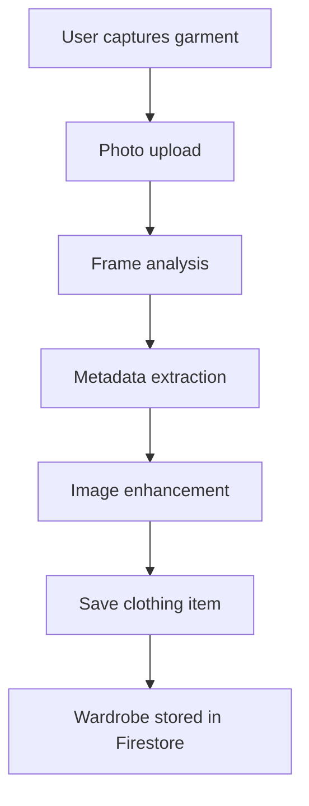
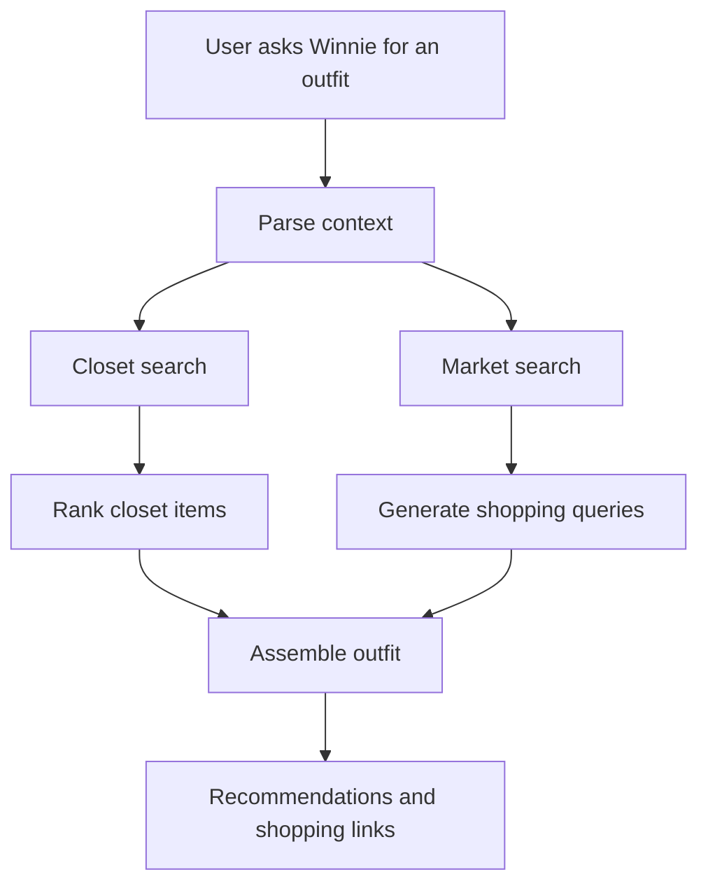
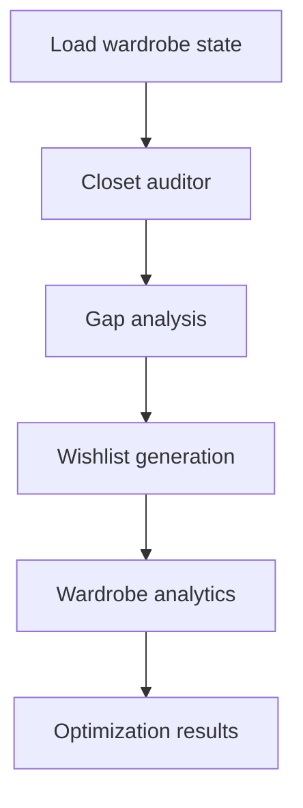
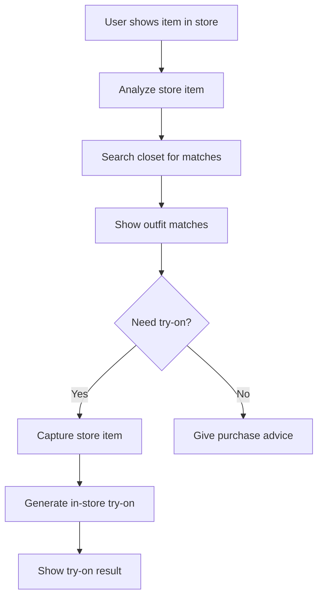
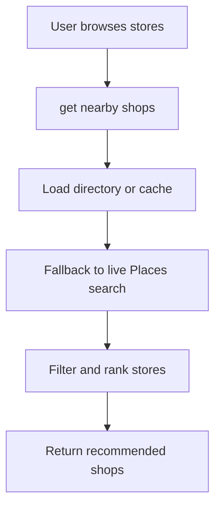
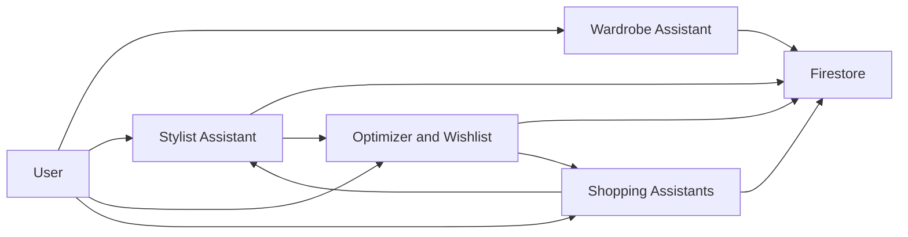

# Winnie AI Tools Overview

Winnie is built from a small set of specialized AI workflows instead of one generic assistant. Each workflow owns a specific job, toolset, and UI surface.

## 1. Wardrobe Assistant

**Purpose:** turn real garments into structured digital closet items.

**Main capabilities**
- analyze garment photos
- extract metadata such as category, color, and material
- normalize and enhance garment imagery
- save the final item to the wardrobe

**Key functions**
- `WardrobeAIService.analyze_frame()`
- `_normalize_enhance_input()`
- `_normalize_enhanced_output()`
- `save_clothing_item()`
- `update_clothing_item()`

## 2. Stylist Assistant

**Purpose:** build outfits from the closet and fill missing slots with shopping suggestions.

**Main capabilities**
- interpret event or style context
- search the closet for matching items
- estimate missing outfit slots
- generate web and market suggestions

**Key functions**
- `_style_profile_from_context()`
- `_search_closet_async()`
- `_infer_item_slot()`
- `_estimate_missing_slots()`
- `_generate_market_queries()`
- `search_web_for_shopping()`

## 3. Wardrobe Optimizer and Wishlist Assistant

**Purpose:** improve the wardrobe over time instead of only reacting in the moment.

**Main capabilities**
- find underused pieces
- detect wardrobe gaps
- turn gaps into wishlist items
- log unmet style intent

**Key functions**
- `_run_auditor()`
- `_llm_gap_analysis()`
- `_heuristic_gap_analysis()`
- `_llm_shopper()`
- `_fallback_shopper()`
- `upsert_wishlist_item()`
- `log_unmet_style_intent()`

## 4. Shopping Assistants

### 4A. Live Shopping Assistant

**Purpose:** help users decide what to buy while they are physically in a store.

**Main capabilities**
- inspect store items from live camera input
- compare them with the user’s closet
- generate in-store try-ons
- route back into styling or wishlist flows

**Key tools**
- `search_closet_for_matches`
- `capture_store_item`
- `generate_in_store_tryon`
- `route_to_specialist`

### 4B. Shop Browser

**Purpose:** help users discover relevant stores nearby.

**Main capabilities**
- browse nearby shops
- load city-level store directories
- refresh cached store data
- rank stores for the current user context

**Key functions**
- `get_nearby_shops()`
- `list_city_directory()`
- `refresh_city_directory()`

## Overall System

## Main AI Services Used

- `Gemini Live API` for real-time voice interaction
- `Gemini reasoning and image flows` for styling, scanning, and enhancement logic
- `Firestore` as shared memory for wardrobe, wishlist, and store context
- `Google Places and Maps` for nearby store discovery
- `Cloud Run` for backend deployment and agent tool execution

## Design Principle

Winnie is strongest when these tools stay specialized but connected:
- scan creates structured wardrobe memory
- stylist uses that memory
- optimizer turns repeated gaps into wishlist actions
- shopping uses closet and wishlist context in real time
