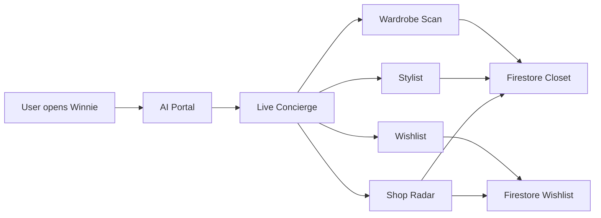

# Winnie - Your Wardrobe OS

Winnie is a multimodal fashion agent built for the [Gemini Live AI Challenge](https://geminiliveagentchallenge.devpost.com/?_gl=1*1bb9o5q*_gcl_au*NDU1ODYyNDExLjE3NjY1MzIwMjU.*_ga*MTY5MTA0NzE3LjE3NTc2MTM5MjY.*_ga_0YHJK3Y10M*czE3NzM3MDExNDkkbzgwJGcxJHQxNzczNzAxOTg5JGo0MiRsMCRoMA..): a wardrobe scanner, stylist, wishlist memory, and shop scout wrapped into one fashion experience.

It is designed around live interaction:
- talk to the agent naturally
- scan garments with camera input
- generate try-ons and shopping suggestions
- keep wardrobe, wishlist, and store context connected

## What Winnie Does

- `Wardrobe scan`: turns real clothes into structured closet items
- `Stylist`: builds outfits from your closet and finds gaps
- `Wishlist`: saves missing pieces and longer-term wants
- `Shop radar`: browses nearby stores and supports in-store assistance
- `Optimizer`: surfaces underused items and wardrobe gaps

## Stack

- `Frontend`: Expo + React Native + React Native Web
- `Backend`: FastAPI
- `Auth / data`: Firebase Auth + Firestore
- `Live AI`: Gemini Live API
- `Vision / reasoning`: Gemini models
- `Maps / places`: Google Maps + Google Places
- `Hosting`: Firebase Hosting
- `Backend deploy`: Google Cloud Run

## Repo Structure

```text
apps/
  backend/     FastAPI backend, live agent configs, AI services
  mobile/      Expo app, tab UI, AI concierge, shop radar
deploy/
  scripts/     deployment scripts
  terraform/   Google Cloud infrastructure
firebase/
  ...          Firestore rules and indexes
AI_TOOLS_OVERVIEW.md
               concise overview of the AI workflows and tools
```

## Local Run

### 1. Mobile

```bash
cd apps/mobile
npm install
npx expo start
```

Set:

```bash
EXPO_PUBLIC_API_BASE_URL=http://localhost:8080
```

in `apps/mobile/.env`.

### 2. Backend

```bash
cd apps/backend
python -m venv .venv
.venv\Scripts\activate
pip install -r requirements.txt
uvicorn app.main:app --reload --port 8080
```

Configure backend secrets in `apps/backend/.env`.

## Deploy

### Frontend only

```powershell
$env:EXPO_PUBLIC_API_BASE_URL='https://your-backend-service-url.run.app'
firebase use <your-project-id>
npx expo export --platform web --output-dir apps/mobile/dist
firebase deploy --only hosting
```

### Full stack

```powershell
$env:EXPO_PUBLIC_API_BASE_URL='https://your-backend-service-url.run.app'
firebase use <your-project-id>
.\deploy\scripts\deploy.ps1
```

## Core Product Flow



## Diagrams

### System Architecture



### Agent Logic



## Useful Docs

- [AI tools overview](./AI_TOOLS_OVERVIEW.md)
- [Deployment README](./deploy/README.md)

## Why This Project Is Fun

Because it is not just “chat with a fashion bot.”

Winnie sees garments, remembers your closet, tracks what you actually wear, saves what you are missing, and helps you make decisions while shopping in the real world.

Read more about the motivation and story behind Winnie [here](https://devpost.com/software/winnie-your-wardrobe-os).